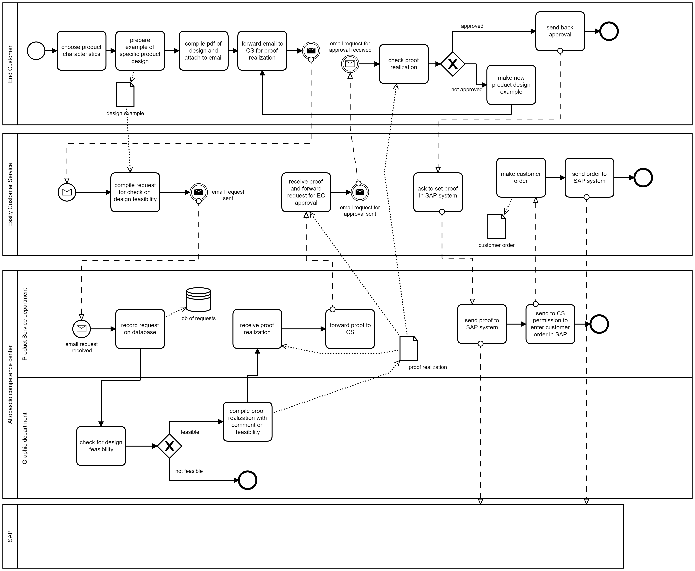

Model of Organization – as is

# Identification

Essity Italy S.p.A. with sole shareholder, registered office in Badia Pozzeveri - Lucca

Fiscal ID: 03318780966

Ateco Code: 17.12

Category: production and selling of hygiene and health care goods

Website: [www.essity.it](https://www.essity.it/)

The analysis in the first paragraphs of this document covers information from both Essity Italy S.p.A and worldwide Essity Company (ex. turn over, certifications etc.)

# Financial and legal information

Legal form: S.p.A.

Turn over year 2020: 479.000.000 €

The ESSITY group recognizes the importance of sustainability excellence for the success of its business and therefore promotes the initiatives finalized to the achievement of social and environmental targets.

Certifications: 

- ISO 9001:2008 (Multisite)
- ISO 14001: 2004 (Multisite) 
- CoC-FSC (Multisite) 
- CoC-PEFC (Multisite) 
- OHSAS 18001:2007 (Multisite) 
- SA 8000:2008 for all the manufacturing plan and for the administrative and commercial sites; 
- ECOLABEL for Lucca 2 plant; 
- ETR for the plants of Lucca 1, Altopascio e Collodi; 
- EU ETS for the plants of Lucca 1, Altopascio e Collodi; • ITS – MPC – Altopascio.

# Organizational variables

## Size

Essity is present in around 150 countries through leading global brands, such as TENA and Tork, and other important brands such as Jobst, Leukoplast, Libero, Libresse, Nuvenia, Lotus, Nosotras, Saba, Tempo, Vinda and Zewa. The Essity group has approximately 46,000 employees in the world and about 900 employees in Italy.

## Products, services

Essity includes three business areas:
- Health & Medical: encompasses the Incontinence Products Health Care and Medical Solutions categories.
- Consumer Goods: includes the categories of Incontinence Products Retail, Baby Care, Feminine Care and Consumer Tissue.
- Professional Hygiene: comprises complete hygiene solutions, including toilet paper, paper hand towels, napkins, hand soap, hand lotion, hand sanitizers, dispensers, cleaning and wiping products as well as service and maintenance under the globally leading Tork brand.

## Goal, goal type, mission, vision, strategy

Essity has a clear strategy for increased value creation. Through the vision: Dedicated to improving well-being through leading hygiene and health solutions, Essity strives to achieve long-term value creation for shareholders, customers, consumers, society and employees. Essity's mission is to sustainably develop, produce, market and sell value-added products and services within hygiene and health. 
Through innovation, digitalization, leading market positions and a greater presence in the fastest-growing sales channels, as well as world-class service levels, quality and efficiency, Essity creates added value for customers and consumers. His strategy and operations are based on a sustainable business model aimed at achieving profitable growth and responsible value creation, all of which is centered around customers and consumers.

## Culture
Essity’s culture is based on four main aspects: courage, collaboration, care and commitment.

- Courage: this means high ambitions and focus on winning for the future. Essity’s employees are dedicated to developing innovative products and services that better serve customers and consumers;

- Collaboration: this means people at Essity seek out diversity of perspectives and ideas. They also trust and challenge each other constructively and celebrate success as a team;

- Care: this means showing respect and proactively supporting each other. Essity acts with integrity towards all stakeholders. Sustainability is part of everything the company does;

- Commitment: this means dedication to delivering results and to improving everyday. 
Another important point is that whatever is done, has to create a certain value.

## Structure
The organizational chart is the following:

Essity is an organization that has a functional, geographical and divisional structure.

In addition to a legal and administrative office in Altopascio (Lucca) and a commercial office (Sales & Marketing) in Legnano (Milan), Essity in Italy has three plants located in Porcari (Lucca), Altopascio (Lucca) and Collodi (Pistoia) dedicated to "tissue" production.
The IT part on the organizational chart is not specified because, as written below, we dont'have enough informations.
### IT/IS  group / office

The IT office is centralized and based in Germany. Unfortunately, the company hasn’t shared with us any further information on how it is organized and managed. In any case, by the size of the company and the description of some processes it is possible to say that probably the IT office is in charge of the management of the database used to collect and handle the orders, as well as the security of customer data.

IT expences could be estimated as 1%-3% of the total income, so it could be around 5.000.000-14.000.000 €.

## Organizational type

The Essity S.p.A. is organized in a mechanical structure due to productions and material requirements are based on centralized forecasts realized, respectively, once per week and month.

The organization is a divisionalized bureaucracy because it has various brands and business units as well as divisional structure. Moreover, it counts facilities in 150 countries.

# Business Model Canvas
				

# IS Views

## Functional view, data

## Functional view, processes

| Process name | Description | Input | Output |
| --- | --- | --- | --- |
|P1. Mananging of customer complaints|The customer makes a complaint about a product or a service offered by the company and gets assistance  | Customer complaint (email, face to face or call center) | Recorded compliant |
|P2. Product design PT1| End customer (EC) asks to the customer service (CS) of reference for a proof realization of a specific design. The CS representative gets in contact with the product service specialist (PS) belonging to the Altopascio competence center asking for a check on design feasibility and proof realization for it | Example of customer logo  | |
|P3. Product design PT2 | PS specialist registers the request in a dedicated database and forward the request of proof realization to the graphic department, also belonging to the Altopascio competence center. The Graphic department sends back the proof to the PS specialist once ready | Request of evaluation  | Evaluation on design feasibility and proof of realization  |
| P4. Product design PT3  | PS specialist send back to the CS the proof realized with comment on feasibility and asking EC’s approval for the proof. If the EC agrees, CS sends the approval to PS and asks to set the proof in SAP system, giving the green light to the CS for entering the customer order (SO) in SAP. | EC approval | Proof of realization in the SAP system |
| P5. Production timeframe definition  | CS insert delivery date in the sales order, automatically SAP calculates correct production date, making a sum of different lead time, which are settled by article level.| Delivery date of different products | Production date of products |
| P6. Raw materials check/ordering/production | Production department checks and confirms orders and productions of raw material.|  | Detailed account of orders/production of raw materials |
| P7. Planning of different product orders | Planning department takes care of production’s optimization by grouping all product orders which have same characteristics in order to avoid losses, creating product families to be reviewed with production leaders when needed and always keep attention to preserve delivery date.| Account of orders and their description  | Calendar of product orders |
| P8. Production planning | Planning department confirm planned order in SAP and transform it into a production order, so it’s then visible to production’s people via Plain, an internal database linked to SAP which shows all relevant information (dates, quantities and duration) needed to start the preparation of the materials and organize all the activities the correct times.| Calendar of planned orders | Final production calendar |
| P9. Product Shipment and delivery | When production is completed, Product Service creates a delivery number to associate order from the producing plant to the delivery plant. Supply Service takes care of the custom print shipping, creating the shipment number which is linked to delivery number, and can contain different orders to be sent to the same country: this information is filled and shared with carries via Transporeon, a digital platform. Carriers take care of reserving a loading slot on Transporeon platform for the day the load is requested from SAP. | Delivery number | New Shipment number and time |

**Notes**
- The End Customer can be an external company that requests a specific design and production for a product or it can be the Essity company itself that requests a design for a new product. This design includes both the packaging and the model of the product itself. For example, if we want to design a new napkin model, we need to design all the napkin's features (shape, type of the paper, packaging, etc.).
- Essity provides standard features for their products (shape, size, paper type, etc.). When the customers set the design request they specify also the characteristics of the product.

BPMN view - Process 1

Here we will describe only the design process of the product and not the production which is, indeed, managed by the production department (not considered in this process).

BPMN view - Process 2

The raw materials stock has a safety treshold so that the orders are never postponed while the production facility order from suppliers.
The treshold is computed monthly from many different factors. The company treated this information as confidential but we can assume it to be based on a market analysis.  

## IT  view

### Application portfolio

| Application name | Vendor (or internal if made internally) | Main functions |
| :---: | :---: | :--- |
| E-mail | Web based | Used for e-mail communications |
| SAP | SAP | It is an ERP software used to manage all the informations and features (production date, planned order ecc.) related to each customer's order |
| Plain | SmeUp | It is an ERP software used to show all the relevant information (dates, quantities and duration) needed to start the preparation of the materials and to organize all the activities in the correct times |
| Transporeon | Transporeon Company | It is a digital platform used to create a shipment number, linked to a specific delivery number |

### Technological view

### Outsourcing

The IT services outsourced are:

|  | Object | Unicity | Location |
| :---: | :---: | :--- | :---: |
| SAP software | Application | Solution for many customers: shared, mass market (with some customization) | Off-site |
| Plain software | Application | Solution for many customers: shared, mass market (with some customization) | Off-site |
| Transporeon software | Application | Solution for many customers: shared, mass market | Off-site |

# IT strategy

IT in Essity plays an important role in planning production effectively, reducing costs, time and preserving the delivery date.

Althought all these aspects are relevant, planning requires standard tools already offered by specialized society. Indeed, they need applications to manage production date, orders, raw material and delivery, functionalities offered by tools like SAP, Plain, Transporeon.

Sensitive and important information, such as customers data, are collected in a database that reasonably should be managed by the internal IT office. Essity hasn't shared this information with us, so it is our assumption considering the size of the company and some process descriptions.

For all these reasons, the IT strategy can be considered consistent with the business strategy.

# Indicators

## CSF

| CSF ID | Type (domain, distinguishing, environment, contingency) | Textual description, link to strategy | Related Metric(s) | Current value |
| :---: | :---: | --- | --- | :---: |
| CSF1 |  Business |Increase customer satisfaction   | Percentage of customer satisfied about the final products   | - |
| CSF2  |Business | Increase efficiency of Graphic Department  | Number of skilled workers in Graphic Department  | - |
| CSF3  |  Business | Increase efficiency of Customer Service  | - | - |
| CSF3.1 |  Business | Response time |  Time to process a new request from a EC(End Customer) and give to it a feedback  | - |
| CSF3.2 |  Business | Courtesy level of Customer Service  | Number of complaints from EC  | - |
| CSF4 |  Business |Competence of PS(Product Specialist) Service | Years of experience | - |
| CSF5 |  Business |Increase optimization by grouping all orders with the same characteristics| Number of merged orders | - |
| CSF6 |  Business |Supply Service fairness in operations| Number of operation without errors/Number of total operations | - |
| CSF7|  Business |Efficiency of shipment service about costs| Price per shipment(by agency)| - |
| CSF8 | Business | Competitive cost of final product given the high level of market competition | Cost per single stock sold (specific for each customized product) | - |
| CSF 9  |Business | Increase efficiency of Planning Department | Time from check stock of raw materials to order new materials or confirm planned SAP order| - |

## KPI

### Processes P1, P2, P3, P4, P5

| KPI name | KPI type | Description | Unit of measure | CSF covered | Current value |
| :---: | :---: | :--- | :---: | :---: | :---: |
| N_EC | General | Number of end customers per year | Count | - | - |
| N_P | General | Number of proofs realized per year | Count | - | - |
| N_CO | General | Number of customer's orders per year | Count | - | - |
| N_ECS | General | Number of employees belonging to the customer service | Count | - | - |
| N_ACC | General | Number of employees belonging to the Altopascio competence center (including employees of the graphic department) | Count | - | - |
| LT_PRD | Service | It is the time needed for the factory to ensure production availability, both for a capacity point of view and a material's order timing. It can be changed accordingly with RBL, Regional Business Logistic Director and sales representees, increased ad hoc in case of issues based on the capacity of the line or other issues | Time | - | - |
| P_R | Service | Punctuality in delivering the work with respect to the estimated time | Time | CSF2 | - |
| LT_R | Service | Lead time for proof realization (from the EC asks for a proof realization, to the CS sends the proof realized with comment on feasibility asking the approval from the end customer) | Time | CSF3, CSF4 | - |
| T_C1 | Efficiency | Effort of employees belonging to the Altopascio competence center + effort of employees belonging to the customer service + cost of the software licences | Euro | - | - |
| UC_O | Efficiency | Unit cost for an order = T_C / N_CO | Euro | CSF8 | - |
| C_P | Quality | 100 * (#customer's orders with defects / N_CO) -> Order with defects: order issued with a proof realization not approved by customer, order issued with an old proof realization ecc. | % | CSF1 | - |
| C_S | Quality | Customer satisfaction | Direct contact with CS representative | CSF1, CSF2, CSF3 | - |

### Processes P6, P7, P8, P9

| KPI name | KPI type | Description | Unit of measure | CSF covered | Current value |
| :---: | :---: | :--- | :---: | :---: | :---: |
| N_S | General | Number of shipments per year | Count | - | - |
| N_EPS | General | Number of employees belonging to product service | Count | - | - |
| N_EPD | General | Number of employees belonging to planning department | Count | - | - |
|N_ESS | General | Number of employees belonging to supply service | Count | - | - |
| LT_P | Service | Lead time of orders' planning (from customer's order entered to order delivered at delivery plant) | Time | CSF5 | - |
| T_GRP | Service | Time needed to send goods from producing plant to the shipping warehouse | Time | CSF5 | - |
| T_GIP | Service | Time needed for goods' acceptance and shipment's preparation | Time | CSF5 | - |
| T_T | Service | Time needed to send the goods to delivery destination | Time | CSF5 | - |
| T_CH | Service | Time needed to check availability of materials in stock | Time | CSF9 | - |
| T_C2 | Efficiency | Effort of employees belonging to supply service + effort of employees belonging to product service + effort of employees belonging to planning department + cost of shipments + cost of software licences | Euro | - | - |
| UC_S | Efficiency | Unit cost of shipments = T_C / N_D | Euro | CSF7 | - |
| P_S | Quality | Punctuality of shipment with respect to the shipment's estimated time | Time | CSF1, CSF6 | - |
| N_OD | Quality | 100*(#shipments with defects / N_S) -> Shipments with defects: order assigned to the wrong shipment, shipment done to the wrong delivery plant ecc. | % | CSF1, CSF6 | - |

# Summary analysis

Essity is a multinational organization with customers belonging to 150 different countries. This is not something that happens by chance and, as a matter of fact, it means that in addition to the constant pursuit of environmental sustainability and excellence in every product they sell, each employee is fully focused on the company's goal.

We chose to focus our attention on the part of the organization that manages production and customers in Italy. By analyzing the situation, we saw that the It area is aligned with the company's strategy, in fact, the main resources (both economic and physical), are employed in the production, care of the products and the relationship with customers. That's why the majority of the IT services (SAP, Plain ecc.) are outsourced.

We therefore chose to analyze the customization of products which can be split into two smaller sub-processes (BPMN1, BPMN2).

We think that although the entire process is well organized, the overall situation could be better, in particular for the **raw materials check** (P6 in the processes table) and the **product design** (P2, P3, P4 in the processes table), where for instance, revisions and improvements could imply a less waste of resources and a more efficient communication between the customer, the customer service and the product service specialist. This will be one of the subject covered in the To Be report.

