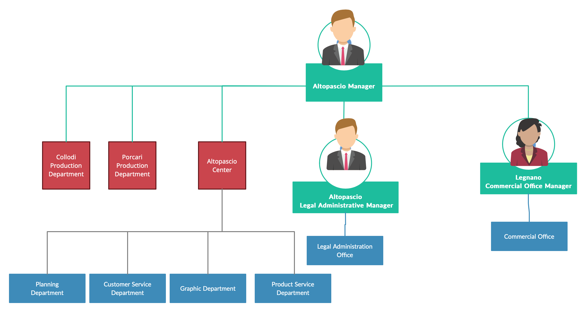

Model of Organization – as is

# Identification

Essity Italy S.p.A. with sole shareholder, registered office in Badia Pozzeveri - Lucca

Fiscal ID: 03318780966

Ateco Code: 17.12

Category: production and selling of hygiene and health care goods

Website: [www.essity.it](https://www.essity.it/)

# Financial and legal information

Legal form: S.p.A.

Turn over year 2020: 479.000.000 €

The ESSITY group recognizes the importance of sustainability excellence for the success of its business and therefore promotes the initiatives finalized to the achievement of social and environmental targets.

Certifications: 

- ISO 9001:2008 (Multisite)
- ISO 14001: 2004 (Multisite) 
- CoC-FSC (Multisite) 
- CoC-PEFC (Multisite) 
- OHSAS 18001:2007 (Multisite) 
- SA 8000:2008 for all the manufacturing plan and for the administrative and commercial sites; 
- ECOLABEL for Lucca 2 plant; 
- ETR for the plants of Lucca 1, Altopascio e Collodi; 
- EU ETS for the plants of Lucca 1, Altopascio e Collodi; • ITS – MPC – Altopascio.

# Organizational variables

## Size

Essity is present in around 150 countries through leading global brands, such as TENA and Tork, and other important brands such as Jobst, Leukoplast, Libero, Libresse, Nuvenia, Lotus, Nosotras, Saba, Tempo, Vinda and Zewa. The Essity group has approximately 46,000 employees in the world and about 900 employees in Italy.

## Products, services

Essity includes three business areas:
- Health & Medical: encompasses the Incontinence Products Health Care and Medical Solutions categories.
- Consumer Goods:includes the categories of Incontinence Products Retail, Baby Care, Feminine Care and Consumer Tissue.
- Professional Hygiene: comprises complete hygiene solutions, including toilet paper, paper hand towels, napkins, hand soap, hand lotion, hand sanitizers, dispensers, cleaning and wiping products as well as service and maintenance under the globally leading Tork brand.

## Goal, goal type, mission, vision, strategy

Essity has a clear strategy for increased value creation.Through the vision: Dedicated to improving well-being through leading hygiene and health solutions, Essity strives to achieve long-term value creation for shareholders, customers, consumers, society and employees. Essity's mission is to sustainably develop, produce, market and sell value-added products and services within hygiene and health. 
Through innovation, digitalization, leading market positions and a greater presence in the fastest-growing sales channels, as well as world-class service levels, quality and efficiency, Essity creates added value for customers and consumers. His strategy and operations are based on a sustainable business model aimed at achieving profitable growth and responsible value creation, all of which is centered around customers and consumers.

## Culture
Essity’s culture is based on four main aspects: courage, collaboration, care and commitment.

- Courage: this means high ambitions and focus on winning for the future. Essity’s employees are dedicated to developing innovative products and services that better serve customers and consumers;

- Collaboration: this means people at Essity seek out diversity of perspectives and ideas. They also trust and challenge each other constructively and celebrate success as a team;

- Care: this means showing respect and proactively supporting each other. Essity acts with integrity towards all stakeholders.Sustainability is part of everything the company does;

- Commitment: this means dedication to delivering results and to improving everyday. 
Another important point is that whatever is done, has to create a certain value.

## Structure
The global organization is the following:

Essity is an organization that has a functional geographical and divisional structure. It is divided into group functions (HR, Finance, Communications, Legal Affairs, Strategy & Business Development) and global units (Professional Hygiene, Consumer Goods, Latin America, Health and Medical Solutions, Global Supply Chain, Global Brand, Innovation and Sustainability, Global Operational Services).

Also in Italy the organizational structure is the same.

In addition to a legal and administrative office in Altopascio (Lucca) and a commercial office (Sales & Marketing) in Legnano (Milan), Essity in Italy has three plants located in Porcari (Lucca), Altopascio (Lucca) and Collodi (Pistoia) dedicated to "tissue" production.

### IT/IS  group / office

If present, describe IT office (where in structure, size, skills)

If not, describe how IT services are decided and managed (external provider, external consultant, ..)

If possible, report or estimate expense in IT

Report ratio: expense in IT / Turn over

## Formalization / specialization/ centralization

## Organizational type

Argument if organization is: mechanical / learning

Argument if organization is: entrepreneurial start up / divisionalized bureaucracy / etc

# Business Model Canvas

	
Business Model Canvas
				

Remark: key processes box must be consistent with IS Views /  Process view (below)

# IS Views

## Functional view, data

UML class diagram for data conceptual model (common to all processes / all organization)

## Functional view, processes

List and describe key processes

| Process name | Description (text) | Input | Output |
| --- | --- | --- | --- |
|P1. Mananging of customer complaints|The customer makes a complaint about a product or a service offered by the company and gets assistance or a refound  | Customer complaint (email, face to face or call center) |   |
|P2. Product design approval | End customer (EC) asks to the customer service (CS) of reference for a proof realization of a specific design representing for example customer’s logo. The CS representative gets in contact with the product service specialist (PS) belonging to the Altopascio competence center asking for a check on design feasibility and proof realization for it | Example of customer logo  | Check on design feasibility |
|P3.   |   |   |   |
|   |   |   |   |
|   |   |   |   |
|   |   |   |   |
|   |   |   |   |
|   |   |   |   |

(must be consistent with key processes box in BMC)

(corresponds to &#39;Process identification&#39; step, see chapter &#39;Process redesign&#39; in lessons )

For processes that will be changed in the transition to To Be report BPMN model

## IT  view

### Application portfolio

List IT applications or services used

| Application name | Vendor (or internal if made internally) | Main functions |
| --- | --- | --- |
|   |   |   |

### Technological view

UML deployment diagram, showing computational nodes, and allocation of applications + data clusters to nodes

(data clusters == group of classes, from the data model, UML class diagram)

(applications are the ones identified in application portfolio)

### Outsourcing

Highlight which IT service is outsourced (if any)

# IT strategy

Summarize the current IT strategy, discuss if it is consistent with the company strategy

# Indicators

## CSF

| CSF ID | Type (domain, distinguishing, environment, contingency) | Textual description, link to strategy | Related Metric(s) | Current value (if available) |
| --- | --- | --- | --- | --- |
| CSF1 |  Business |Increase customer satisfaction   | Percentage of customer satisfied about the final products   |   |
| CSF2  |Business | Increase efficiency of Graphic Department  | Number of skilled workers in Graphic Department  |   |
| CSF3  |  Business | Increase efficiency of Customer Service  |    |   |
| CSF3.1 |  Business | Response time |  Time to process a new request from a EC(End Customer) and give to it a feedback  |   |
| CSF3.2 |  Business | Courtesy level of Customer Service  | Number of complaints from EC  |   |
| CSF4 |  Business |Competence of PS(Product Specialist) Service | Years of experience ||

## KPI

### Process X

(Process name must be consistent with IS view / Process view)

KPI table for process X

| KPI name | KPI type (general, service..) | description | Unit of measure | CSF covered (if any) | Current value (if available) |
| --- | --- | --- | --- | --- | --- |
|   |   |   |   |   |   |

### Process Y

To be repeated for each relevant process (notably processes that will be changed in To Be)

# Summary analysis

Critical points in the organization and their possible interaction with IS.

IT alignment problems.
