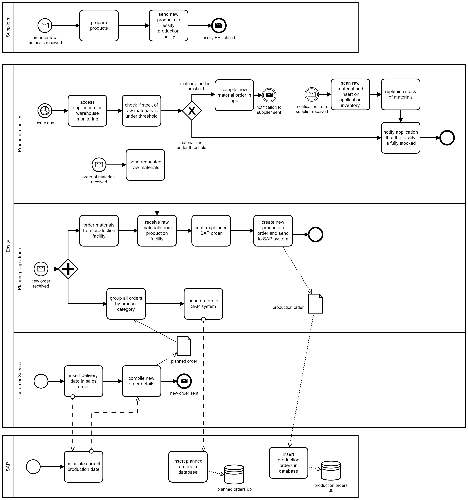
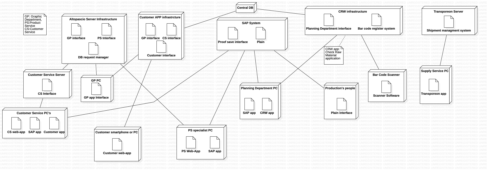

Model of Organization – To Be

# Summary of changes

Here describe at high level the change(s), and their motivation. Link with critical points identified in As Is analysis

The following sections are meant to describe in more detail the changes, using the same structure used in the As Is document.

# Organizational variables

## Size

&#39;no change&#39;

## Products services

&#39;no change&#39;

## Goal, goal type, vision, mission, strategy

&#39;no change&#39;

## Culture

&#39;no change&#39;

## Structure

&#39;no change&#39;

### IT office

The IT Office will slightly change because new backend functionality will be added to manage the new application. The main change will be an reorganization of the existing team, creating a department entirely focused on the customer application.

## Formalization specialization centralization

## Organizational type

&#39;no change&#39;

# Business model canvas

# IS Views

## Functional view, data

The new process is managed by an application that allows the automatization of the order request and the check of the state by the customer. For these reasons an account is required for both user and employee as even the workers will access the order information via the app.

Furthermore, it's now possible for the customers to add comments while approving or rejecting the proof and a design feasibility will be attached to each request, even when the request is rejected by the "Altopascio competence center".

## Functional view, processes

Write no change if the model remains as in As Is

### Process selection

Report the PICK chart (see process redesign chapter)  used to select the process to be changed and argument about it

### Process 1

The main problem we found in the As-Is product design process was the number of steps required to fufill a simple request to the Graphic's department. The End customer had to first contact the Essity Customer Service, then the CS had to contact the Altopascio competence center's Product service department, who would have to record in a database the requests to keep track of them. At this point the PS department could contact the Graphic's department and ask for the check and the proof realization. 
All these communications were done by email, so the process was bound to create difficulties in case of an human error (employee fails to send email) and it could take a great amount of time, especially if we consider that a product design can be sent back many times before the final approval. 

We can fix these problems using a specific application that gives direct contact between the End Customer and the Graphic's department. When the EC finished the product design example, he can upload it to the application using a specific request form and notify the Graphic's department, who can at that point start the procedure to check the feasibility of the design. All the communications and the feedback between the two entities can be done through the application, who will send a specific notification every time, and are stored in the application's database.

Every End Customer and Graphic's department employee has an account on the application, with specific privileges depending on their role in the process. The End Customer can check the state of the procedure in the application by logging into the page dedicated to the specific process.
The Essity Customer Service department's employees also have accounts to manage eventual assistance requests from the End Customers. 

| Activity in BPMN | Supporting Software functions |
| --- | --- |
|Create End Customer's account|POST EC's data|
|Upload new product design example|POST product design example|
|Add feedback to product design example|PUT feedback of design|
|Send request for proof realization| Create and Send notification|
|Create product design approval process|Create procedure in software application|
|Upload proof realization of design|POST proof realization|
|Add feedback to proof realization|PUT feedback of proof|
|Search for proof realization by design id| GET proof realization|
|Search for design example|GET product design example|
|Send approval for design feasibility| Create and Send notification|
|Send approval for  proof realization| Create and Send notification|

### Process 2

In the As-Is process the Planning Department has to check the raw material stock for every order received. If the materials are not enough to fufill the order, the department has to get in touch directly with the suppliers and reject the order while it waits for the Production facility to replenish their stock. This is a problem because it loses the company a lot of time waiting for the raw materials and it makes them postpone orders. 
To fix this problem we thought the Production Facility could implement its own checking process for the stock. 
Every material in the facility gets scanned manually with a bar code scanner and is recorded on the application so that we can keep track of the materials that exit the warehouse. The stock is checked by a production department employee through the application every day, and if it gets under a certain threshold the application manages the order request for the suppliers. After the supplier notifies the shipping of the raw materials, the production facility stock gets replenished. 
The application has an inventory of the products for the warehouse that are associated with a specific barcode. It also has an account for the suppliers and the production facility to manage the communications between them, for example when the production facility needs to order new material. 
In the application it's also possible to modify the stock's threshold.

| Activity in BPMN | Supporting Software functions |
| --- | --- |
| Scan new raw material | Barcode scanner |
| Add new material to inventory | POST material description and barcode  |
| Check if stock's is under threshold  | GET warehouse information and execute script based on BR|
| Modify stock's threshold | PUT new threshold |
| Create new production facility account| POST production facility data|
|Add new supplier to supplier list|PUT supplier's description|
|Make order to supplier|Create and send notification|

## IT view

### Application portfolio

Basically the organization, continues to use the same application portfolio as in As Is situation but in the To Be situation, two new applications are introduced: CAPP (Customer Application) and CRW (Check Row material application).

We have reported below the description about only these two new applications.

| Application name | Vendor (or internal if made internally) | Main functions |
| :---: | :---: | :--- |
| CAPP | internal | This application is used to manage with more automation and without some intermediate steps the interaction between the graphic department and the customer |
| CRW | internal | This application is used to check each time a raw material exits the warehouse the remaining availability of that item. The application is so used to notificate the planning department on when a new order has to be done |

#### Selection

The two new applications introduced have to be developed custom for the company mainly for two reasons:
- Firstly as we wrote in the "IT Strategy" section, the core business of the company is not to develop software and so, relying on external developers should be less expensive in terms of time and money and also allows the company to continue focusing resources and employees on the same objectives of the As Is situation.
- Secondly, these applications, should manage a lot of sensible informations and then, unlike the other outsourced applications in the application portfolio, here, the outsourcing possibility is not considered.

#### Coverage

Show how the selected application provides the software functions needed (as identified in Functional view, processes section), discuss gaps, if any

| Software function needed (from process view) | Software function provided by application selected | Gap analysis |
| --- | --- | --- |
|   |   |   |

### Technological view

The new Deployment Diagram highlights the introduction of the new applications.
The first one that manage the customer relationship from the assistance to the creation of a new order with a dedicated interface for draft approval. 
The second one concerns the orders for raw materials with the introduction of bar code scanner and the related bar code for the products.

#### Integration

In case a new application is introduced discuss how integration happens in terms of

Data exchange (which data is exchanged)

Control mechanism (mechanism used by applications to interact, ex message passing, rpc, etc)

# IT strategy

The introduction of a new application follows the Business Strategy of creating values, in this case, for the customer. It will likely need a reorganization in order to meet new requests on data management.

# Effect of change(s)

## Effect on KPIs and CSFs

(remark, KPIs and CSFs should not depend on the change, but should remain the ones defined in the As Is section – the goal being to compare the effect of the change on the same indicators)

Report only indicators that are supposed to change, argument on why the change has an effect on them, report how much the indicator could change. Do not forget the unit cost of the product / service.

| Indicator (Csf, Kpi) name | Effect | Quantitative estimate of variation (absolute, %) |
| --- | --- | --- |
|  CSF1: Customer Satsifation |  Increase because the customers have more managment and user-friendly with the app  | 20% |
|CSF3|The customer service manage the comunication with the customer in a better way with a GUI and trough the app | 30% |
|CSF3.1|The response time (to process a new request from a EC and give to it a feedback) decrease thanks to the good realization of the all infrastructure around the new managment software | 20% |
|CSF5|The number of merged orders can increase thanks to an algorithm| 15% |
|CSF9: Time from check stock of raw materials to order new materials or confirm planned SAP order|The process time has an important decrease because the app automatically manage if a new order is needed  | 40% |
| N_ECS | Could decrease a little because few employees belonging to the customer service could be assigned to other departments  | 5% |
| LT_R | It decreases thanks to the CAPP application. Time for realizing the proof still depends on the graphic department but intermediate steps and useless losses of time are avoided | 30% |
| T_C1, UC_O | They decrease because thanks to the CAPP, effort of employees belonging to the customer service and Altopascio competence center decreases. Costs for software licences of outsourced applications remain the same | 20% |
| N_EPD | Could decrease a little because few employees belonging to the planning department could be assigned to other departments | 5% |
| T_CH | Thanks to automation introduced by the CRW app it should become zero | 100% |
| T_C2, UC_O | They decrease a little because thanks to the CRW app, effort of planning department employees decreases. Effort of employees belonging to other departments and costs for software licences of outsourced applications remain the same | 10% |
| C_S | It increases thanks to the more efficient service offered by the customer service + CAPP | 10% |

## TCO, ROI and Break even

| Phase | Description |
| :---: | :--- |
| Construction C | Acquisition or development of new physical and IT infrastructure |
| Deployment D | Training of employees, installation of bar code readers |
| Operation O | Electricity, conditioning, effort of employees |
| Maintenance M | Maintenance of physical and IT infrastructure |
| Dismissal DIS | Uninstall applications, infrastructure dismissal and data porting to new IT infrastructure |

Assuming:
- **5 years horizon**
- Dismissal phase after 5 years
- **C+D** = 35000€, **O+M** = 3000€, **S** = 13000€

|  | **Year1** | **Year2** | **Year3** | **Year4** | **Year5** |
| --- | :---: | :---: | :---: | :---: | :---: |
| **Cost** | C,D,O,M | O,M | O,M | O,M | O,M |
| **Saving** | SV | SV | SV | SV | SV |
| **Total** | -25000€ | -15000€ | -5000 | 5000 | 15000 |

 - The majority of savings(SV) depends on the lower costs related to the effort of employees

- Assuming the costs we reported above, the break-even point is reached at the fourth year

## Risks

Discuss the main risks (technological, organizational, human factors) related to the change, and what can be done to reduce them

# Conclusion

In summary, why the organization should buy (and pay for) your proposal of change?
